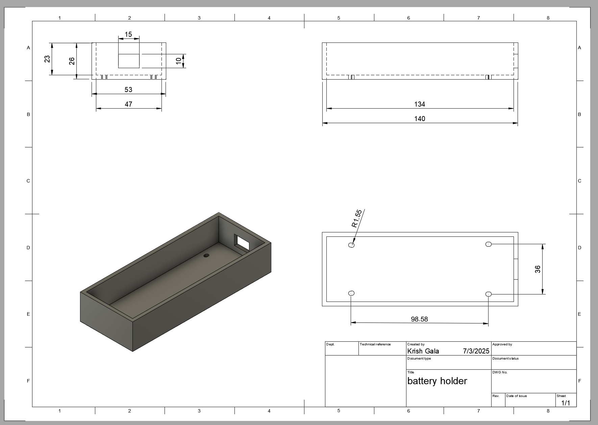

# Hexapod Robot

The Hexapod is a wirelessly controlled six-legged robot with dynamic movement. It can crawl in  any direction, twist its body and raise itself updown with a remote control. Despite its hardships while building the final project turned out well with its modifications such as the custom made battery holder aswell as the pincers on the front end of the Hexapod.

| **Engineer** | **School** | **Area of Interest** | **Grade** |
|:--:|:--:|:--:|:--:|
| Krish G | Leigh High School | Electrical Engineering | Rising Junior


# Modification Milestone

<iframe width="560" height="315" src="https://www.youtube.com/embed/lpSDtB5PY7w?si=JcC3wF_d9Qgiiqeq" title="YouTube video player" frameborder="0" allow="accelerometer; autoplay; clipboard-write; encrypted-media; gyroscope; picture-in-picture; web-share" referrerpolicy="strict-origin-when-cross-origin" allowfullscreen></iframe>

## Battery Holder

Drawing of the Model in Fusion 360



<sub>(Everything in Millimeters)</sub>

Image of Battery Holder


Image of Battery Holder


### Summary
For the first minor modification I added a battery holder to my hexapod. This was just a simple box in modeled in fusion 360. It is attached with spare standoffs and screws. On top of the hexapod there are a few long oval shaped holes specifically for modification so I used four of those to attach the battery holder on top. Overall it was a simple modification though it did have some challenges.


### Challenges
This was actually the second print I did for the battery holder because of an issue on Fusion 360. When I first made the box I used the shell tool to hollow out the cube for the battery. I also used the offset tool in the sketch. These two actually overlapped themselves and the offset actually went inside the box making the dimensions smaller for the battery. I took precise dimensions for the battery so when this happened the battery did not fit. So I just remade it correctly using the shell tool and everything worked fine on the second print. Another minute challenge I had was with the screws and standoffs. The original ones I was going to use were not long enough to both go through the acryic part of the hexapod and have some space to screw into a standoff. This was an easy fix because all I did was just use a new standoff and screw.

## Claw

### Overall Summary
For my modification milestone I've added a two-part claw system. One part of the system allows the claw to move forwards and backward. The second part of the claw system is the actual claw that clamps onto objects. All of the parts were 3d printed and attached to the hexapod. It works via a remote through microcontrollers. 

Full Photo of Hexapod


### Interaction / Technical Summary
They interact through 2 ESP-32s which are microcontrollers. This specific microcontroller was chosen for its built-in wifi module. The two ESPs have unique “MAC” addresses which are essentially unique thumbprints on the network. It allows the ESP to locate and communicate to a specific other ESP. This is via “ESP NOW” which allows the code to be transported in between the two modules, the other code in the radios were basic. All it was saying that a specific button was tied to a specific direction of a servo four times over. With the two connected ESPs I’ve breadboard 4 buttons onto the remote ESP. Each button controls a servo either to move positively or negatively allowing for full movement of protraction and retraction for both parts of the claw. The breadboarding on the Hexapod has two servos connected to the ESP. Battery power on each of the microcontrollers is another key point of my design as they don’t have a unique power source. The one attached to the hexapod was a simple configuration as the hexapod had a spare 5v slot open that allows for the claw system to be powered. While on the remote it was different as there was not a slot open for power. So I used a buck converter to split power directly from the battery on the remote. A buck converter efficiently lowers the voltage to make sure the least amount of battery is lost. With the buck converter I was able to manage the power from the battery onto the original hexapod remote and onto the one I fabricated.

Image of Remote


### Desgin / Model Summary
Moving onto the actual design of the claw system it has two gear interactions. The first one is a “rack and pinion” gear mechanism. It has one standard toothed gear and one that lays flat. This allows for rotational movement to turn into horizontal movement. This is powered by one servo. The other servo powers the claw; it has two gears in tangent. One of the gears is powered while the other one is freestanding against it. Two beams are attached to the gear and the actual curved part of the claw is attached to the beam. The two parts of the claw system are screwed in together. The entire claw system is attached via a 3d printed clamp at the bottom of the entire system that latches onto the bottom of the hexapod. 

Image of Claw Mechanism


Image of Rack and Pinion Mechanism


### Challenges

There were a multitude of challenges across the design and implementation of the claw system. To start off the process I modeled the actual claw system. I created the rack and pinion system successfully but the claw system was another story. The first time I modeled the claws I made the claws too small and the hole for the freestanding claw too tight. After multiple iterations I eventually enlarged the claw in and split it into multiple parts instead of one large extrusion attached to the gear. Moving onto the technical parts, the ESPs were not the first I used. Before attaching the ESPs to a breadboard I had them freestanding. This was a grave mistake because while I was coding for the microcontrollers they likely shorted on the metal on my laptop. This caused the ESP 32 to short out and not power on / or allow for code to run on it. Another challenge was the attachment of the system onto the hexapod. Over time the latch onto the hexapod wore down and the edges and joints of the print were starting to bend. I eventually had to use more permanent measures than pressfitting the system and hot glued it down along with some tape. Another challenge was that the gear system was too topheavy, the end of the rack on the rack and pinion system was leaving off the ground when I powered the servo. To fix this I added a styrofoam brace on top of the back end of the rack that allowed for the rack to move soundly across its base.

Images of 3d Modeled Claw Parts


Wiring Schematic of Remote


Wiring Schematic of Servos on Hexapod


## Code

### Remote ESP-32
This code sends the input from the buttons onto the ESP-32 attached to the claw
```
#include <esp_now.h>
#include <WiFi.h>

// Define button pins
#define BUTTON1 14
#define BUTTON2 27
#define BUTTON3 26
#define BUTTON4 33

uint8_t broadcastAddress[] = { 0x44, 0x1D, 0x64, 0xF8, 0xF8, 0xCC };

typedef struct struct_message {
  int command;  // 1–4 for different button actions
} struct_message;

struct_message myData;
esp_now_peer_info_t peerInfo;

// Send status callback
void OnDataSent(const uint8_t *mac_addr, esp_now_send_status_t status) {
  Serial.print("\r\nLast Packet Send Status:\t");
  Serial.println(status == ESP_NOW_SEND_SUCCESS ? "Delivery Success" : "Delivery Fail");
}

void setup() {
  Serial.begin(115200);

  // Set button pins as input
  pinMode(BUTTON1, INPUT_PULLUP);
  pinMode(BUTTON2, INPUT_PULLUP);
  pinMode(BUTTON3, INPUT_PULLUP);
  pinMode(BUTTON4, INPUT_PULLUP);

  WiFi.mode(WIFI_STA);

  if (esp_now_init() != ESP_OK) {
    Serial.println("Error initializing ESP-NOW");
    return;
  }

  esp_now_register_send_cb(OnDataSent);

  memset(&peerInfo, 0, sizeof(peerInfo));
  memcpy(peerInfo.peer_addr, broadcastAddress, 6);
  peerInfo.channel = 0;
  peerInfo.encrypt = false;

  if (esp_now_add_peer(&peerInfo) != ESP_OK) {
    Serial.println("Failed to add peer");
    return;
  }
}

void loop() {
  int buttonState = 0;

  if (digitalRead(BUTTON1) == LOW) buttonState = 1;       // Servo 1 Left
  else if (digitalRead(BUTTON2) == LOW) buttonState = 2;  // Servo 1 Right
  else if (digitalRead(BUTTON3) == LOW) buttonState = 3;  // Servo 2 Left
  else if (digitalRead(BUTTON4) == LOW) buttonState = 4;  // Servo 2 Right

  if (buttonState != 0) {
    myData.command = buttonState;
    esp_now_send(broadcastAddress, (uint8_t *)&myData, sizeof(myData));
    Serial.print("Sent command: ");
    Serial.println(buttonState);
    delay(300);  // debounce
  }

  delay(20);
}
```

### Claw ESP-32
This code receives the input from the buttons onto the ESP-32 and performs the input.
```
#include <esp_now.h>
#include <WiFi.h>
#include <ESP32Servo.h>

typedef struct struct_message {
  int command;  // 1–4 for different button actions
} struct_message;

struct_message myData;

Servo servo1;
Servo servo2;

int pos1 = 90;
int pos2 = 90;

void OnDataRecv(const esp_now_recv_info_t *recv_info, const uint8_t *incomingData, int len) {
  memcpy(&myData, incomingData, sizeof(myData));
  Serial.print("Command received: ");
  Serial.println(myData.command);

  switch (myData.command) {
    case 1: // Servo Claw In
      pos1 = constrain(pos1 - 10, 0, 180);
      servo1.write(pos1);
      break;
    case 2: // Servo Claw Out
      pos1 = constrain(pos1 + 10, 0, 180);
      servo1.write(pos1);
      break;
    case 3: // Servo Rack In
      pos2 = constrain(pos2 - 10, 0, 180);
      servo2.write(pos2);
      break;
    case 4: // Servo Rack Out
      pos2 = constrain(pos2 + 10, 0, 180);
      servo2.write(pos2);
      break;
  }
}

void setup() {
  Serial.begin(115200);
  WiFi.mode(WIFI_STA);

  servo1.attach(13);
  servo2.attach(12);

  servo1.write(pos1);
  servo2.write(pos2);

  if (esp_now_init() != ESP_OK) {
    Serial.println("Error initializing ESP-NOW");
    return;
  }

  esp_now_register_recv_cb(OnDataRecv);
}

void loop() {

}
```


# Final Milestone

<!-- **Don't forget to replace the text below with the embedding for your milestone video. Go to Youtube, click Share -> Embed, and copy and paste the code to replace what's below.** -->

<iframe width="560" height="315" src="https://www.youtube.com/embed/KBowAJ36dcY?si=XoG1bSv90Mwh6wOk" title="YouTube video player" frameborder="0" allow="accelerometer; autoplay; clipboard-write; encrypted-media; gyroscope; picture-in-picture; web-share" referrerpolicy="strict-origin-when-cross-origin" allowfullscreen></iframe>

<!--For your final milestone, explain the outcome of your project. Key details to include are:-->

Image of the Two Wireless Receivers on the Hexapod


### Summary

For the final milestone I added wireless controls in two forms. One through a phone app and one with a wireless controller. I first had to build the remote.  The wireless modules were pretty easy to put in and I had to download a premade script into the remote to work. Then when you turn it one you are able to move it, turn from side to side, and change the height of the body. The phone app used wifi to connect to the robot. It then uses tilt of the phone to move around. Overall this was the simplest milestone. Next step I first want to tie down some wires and then work on modifications. I'm unsure what I'll do but I'm thinking of adding a camera to map the surrounding of the robot.

### Challenges

I think the only major challenge I had was screwing in the case for the board. The screws had another level over the screws and I also needed a spacer between the board and the case. So I had to tape the screw into place with spare tape and turned it upside down. Then I aligned the spacer carefully between the two plates of the remote control and then screwed on a nut with my fingers on.

# Second Milestone

<!-- **Don't forget to replace the text below with the embedding for your milestone video. Go to Youtube, click Share -> Embed, and copy and paste the code to replace what's below.** -->

<iframe width="560" height="315" src="https://www.youtube.com/embed/4nCS2oQNeeo?si=2B7hohqkm9rSDoDX" title="YouTube video player" frameborder="0" allow="accelerometer; autoplay; clipboard-write; encrypted-media; gyroscope; picture-in-picture; web-share" referrerpolicy="strict-origin-when-cross-origin" allowfullscreen></iframe>

<!-- For your second milestone, explain what you've worked on since your previous milestone. You can highlight:
- Technical details of what you've accomplished and how they contribute to the final goal
- What has been surprising about the project so far
- Previous challenges you faced that you overcame
- What needs to be completed before your final milestone -->

Image of the Calibration Sheet


Image of Fully Calibrated Hexapod Legs


### Summary

My second milestone was definitely the lengthiest one as it had me build and calibrate the hexapod. Although it wasn't specifically hard it was to say lightly, a bit tedious. Every single part had lots of screws and the given screwdriver wasn't ergonomic for my hand. The screws were very tiny and a hassle to align but after a day and a half I completed it. Something surprising about the process so far was how the servos automatically zero'd on every startup and it didn't have me create that zero'd state. This was not really a feature as it was difficult to move the servos physically instead of just re-zero it in the correct spot. Going forward for my final milestone I'll be adding a wifi module which will allow me to move the robot without a wire into my laptop.

### Challenges

Then I moved onto wiring the servo modules. The guide had me randomly assign them ports on the mainboard and align the legs of the hexapod off the random ports. Then you'd assign them the correct port. That didn't work for me so I started backwards the the correct ports for each of the servos and then aligned and rescrewed all of the parts of the legs. That worked for me. That was more or less all I had to do for the building portion of this project. Then I moved onto calibration which had me move the legs into a specific place for the robot to move properly as when building you can't get that precise. It wasn't that difficult but I had to redo it once because the first time it just didn't keep the calibrated state when trying to move. Though, on my second time it worked perfectly. Also a small issue was the wires of the servos getting in way of the robot when it was moving. Eventhough there was some cable tidy to tie the servos on the same leg together it would still sometimes get in the way of the robot moving so all I did was tuck the wires under the frame.


# First Milestone

<!-- **Don't forget to replace the text below with the embedding for your milestone video. Go to Youtube, click Share -> Embed, and copy and paste the code to replace what's below.** -->

<iframe width="560" height="315" src="https://www.youtube.com/embed/Xi515reuXZE?si=zpE9ugs6TT8V1UEm" title="YouTube video player" frameborder="0" allow="accelerometer; autoplay; clipboard-write; encrypted-media; gyroscope; picture-in-picture; web-share" referrerpolicy="strict-origin-when-cross-origin" allowfullscreen></iframe>

### Sumary

So far I've set up the Arduino program and the Processing program for the robot. Processing is the built in controller for the robot while Arduino is used for writing my custom code to control each individual servo. The main part of this milestone is to make sure each of the servos are working correctly, which they do. I first used the given controller for the Hexapod to move the servos. I then moved onto the Arduino program where I tested individual servos. I learned that the servos aren't that strong and they started overheating and smoking after running some code that changes the position of the servos from 0 to 180 and back. This led to some of the servos just shutting down for a bit and then restarting because of the load. So, I changed the parameters of the servo to 20 and 40 for easier use on the servo. But using the actual given controller everything looks to be working correctly and in the next step for building. Looks like I didn't actually need to use the extra servo given in the box. In this milestone I've learned alot about how Arduino and the actual board interact. 

### Challenges

When I tried to run the Arduino code while the actual controller was running it didn't work. So next time I need to keep that in mind anytime I want to run some code. I also learned how to read the control board where each servo's connection is a specific port that I can call for in Arduino. I'm excited for the next step, building and calibrating because I'll finally have the robot made!

 <!-- # Code
Here's where you'll put your code. The syntax below places it into a block of code. Follow the guide [here]([url](https://www.markdownguide.org/extended-syntax/)) to learn how to customize it to your project needs. -->

## Code

This code allows testing individual servos.  In the setup the attach function just calls for a specific connection on the Arduino board so it knows where to run it. It then basically sweeps the servo from 20 degrees to 40 degrees and back and repeats infinitely.
```
#include <FNHR.h>
#include <Servo.h>

FNHR robot;

Servo myservo;

int pos = 20;

void setup() {
  robot.Start(true);
  myservo.attach(37); 
}

void loop() {
  for (pos = 20; pos <= 40; pos += 1) { 
    // in steps of 1 degree
    myservo.write(pos);              
    delay(15);                       
  }
  for (pos = 40; pos >= 20; pos -= 1) { 
    myservo.write(pos);              
    delay(15);                       
  }
  robot.Update();
}
```

<!-- c++
void setup() {
  // put your setup code here, to run once:
  Serial.begin(9600);
  Serial.println("Hello World!");
}

void loop() {
  // put your main code here, to run repeatedly:

}
-->

## Hexapod Code Download
<a href="ProcessingApp.zip" download>Download Zip</a>
in Processing Development Environment

## Bill of Materials

| **Part** | **Note** | **Price** | **Link** |
|:--:|:--:|:--:|:--:|
| Freenove Hexapod Robot Kit | Base kit for the Hexapod | $126.99 | <a href="https://store.freenove.com/products/fnk0031?variant=43034490110150"> Link </a> |
| Wires | Connection between all parts | $6.98 | <a href="https://a.co/d/dN75fmB"> Link </a> |
| Breadboard Jumper Wires | Connection between all parts on breadboard (smaller) | $12.88 | <a href="https://a.co/d/7qazyES"> Link </a> |
| ESP-32 Devkit V1 x2 | Connection between all parts on breadboard (smaller) | $8.09 x2 | <a href="https://www.digikey.com/short/jfvbnzbn"> Link </a> |
| M3 Screwkit | Screws between parts such as attachment of Battery Holder and Parts of Claw System | $8.99 | <a href="https://a.co/d/1LfDGjP"> Link </a> |
| MG90S 9g Servo | Servos to power Claw System | $8.88 | <a href="https://a.co/d/gpatAwY"> Link </a> |
| 7.2V Battery Pack | Power to hexapod and Claw System | $21.99 | <a href="https://a.co/d/d4JsQca"> Link </a> |
| Buck Converter | To manage voltage for the 2 parts of the remote | $7.99 | <a href="https://a.co/d/4hSDY0T"> Link </a> |
| Breadboards | Large Breadboard for Hexapod and Small Breadboard for Remote | $5.99 | <a href="https://a.co/d/cyosirK"> Link </a> |
| Buttons | To control claw servos | $5.99 | <a href="https://a.co/d/fkq63wj"> Link </a> |
| 9v Battery | Power remote | $9.79 | <a href="https://a.co/d/dGDbJKI"> Link </a> |

## Schematics

## Hexapod External View

## Remote Control External View

## Remote Control Schematic

[**SOURCE**](https://freenove.com/fnk0031)

<!-- # Bill of Materials
Here's where you'll list the parts in your project. To add more rows, just copy and paste the example rows below.
Don't forget to place the link of where to buy each component inside the quotation marks in the corresponding row after href =. Follow the guide [here]([url](https://www.markdownguide.org/extended-syntax/)) to learn how to customize this to your project needs. 

| **Part** | **Note** | **Price** | **Link** |
|:--:|:--:|:--:|:--:|
| Item Name | What the item is used for | $Price | <a href="https://www.amazon.com/Arduino-A000066-ARDUINO-UNO-R3/dp/B008GRTSV6/"> Link </a> |
| Item Name | What the item is used for | $Price | <a href="https://www.amazon.com/Arduino-A000066-ARDUINO-UNO-R3/dp/B008GRTSV6/"> Link </a> |
| Item Name | What the item is used for | $Price | <a href="https://www.amazon.com/Arduino-A000066-ARDUINO-UNO-R3/dp/B008GRTSV6/"> Link </a> |

# Other Resources/Examples
One of the best parts about Github is that you can view how other people set up their own work. Here are some past BSE portfolios that are awesome examples. You can view how they set up their portfolio, and you can view their index.md files to understand how they implemented different portfolio components.
- [Example 1](https://trashytuber.github.io/YimingJiaBlueStamp/)
- [Example 2](https://sviatil0.github.io/Sviatoslav_BSE/)
- [Example 3](https://arneshkumar.github.io/arneshbluestamp/)

To watch the BSE tutorial on how to create a portfolio, click here. -->

# Weevil Starter Project

<iframe width="560" height="315" src="https://www.youtube.com/embed/8W17v3A6jmY?si=norvQOObzwAQvrP6" title="YouTube video player" frameborder="0" allow="accelerometer; autoplay; clipboard-write; encrypted-media; gyroscope; picture-in-picture; web-share" referrerpolicy="strict-origin-when-cross-origin" allowfullscreen></iframe>

Image of Weevil Robot for Scale


Image of Weevil Robot Fully Built


### Sumary

My starter project was the WeevilEye. The purpose of the project was the two LEDs that the weevils 'eyes' would light up if the photo sensor on the backend detected low enough light to send a signal to light the eyes up. It was composed of the mainboard, 2 220 resistors, 1 47k resistor, a battery casing, a disc battery, a photo sensor, and a transistor. This was the first project I soldered on so I was nervous I'd do it wrong. 

### Challenges

This did somewhat come true because the first time I built the project it didn't work. Not because of my bad solders but I swapped the places of two of my resistors. The position of the battery holder was extremely intrusive because it was soldered on the opposite of all of the other components that it would be extremely difficult to desolder all of it. So, my instructor and I just decided to restart on a new one and this time it worked. Overall I think this was a good beginner project and I feel more prepared to start my actual one.

## Bill of Materials

| **Part** | **Note** | **Price** | **Link** |
|:--:|:--:|:--:|:--:|
| SparkFun WeevilEye - Beginner Soldering Kit | Contains the parts to power, light up, and detect light around the build. | $11.25 | <a href="https://www.sparkfun.com/sparkfun-weevileye-beginner-soldering-kit.html"> Link </a> |

## Schematics 


[**SOURCE**](https://cdn.sparkfun.com/datasheets/Kits/Weevil_Eye-v16.pdf)
